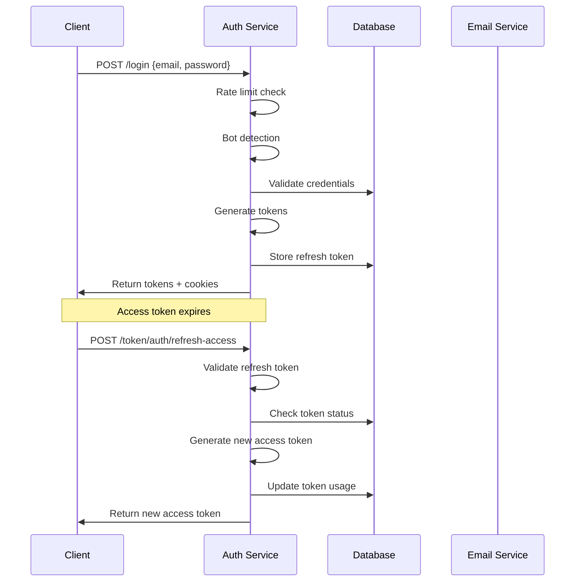
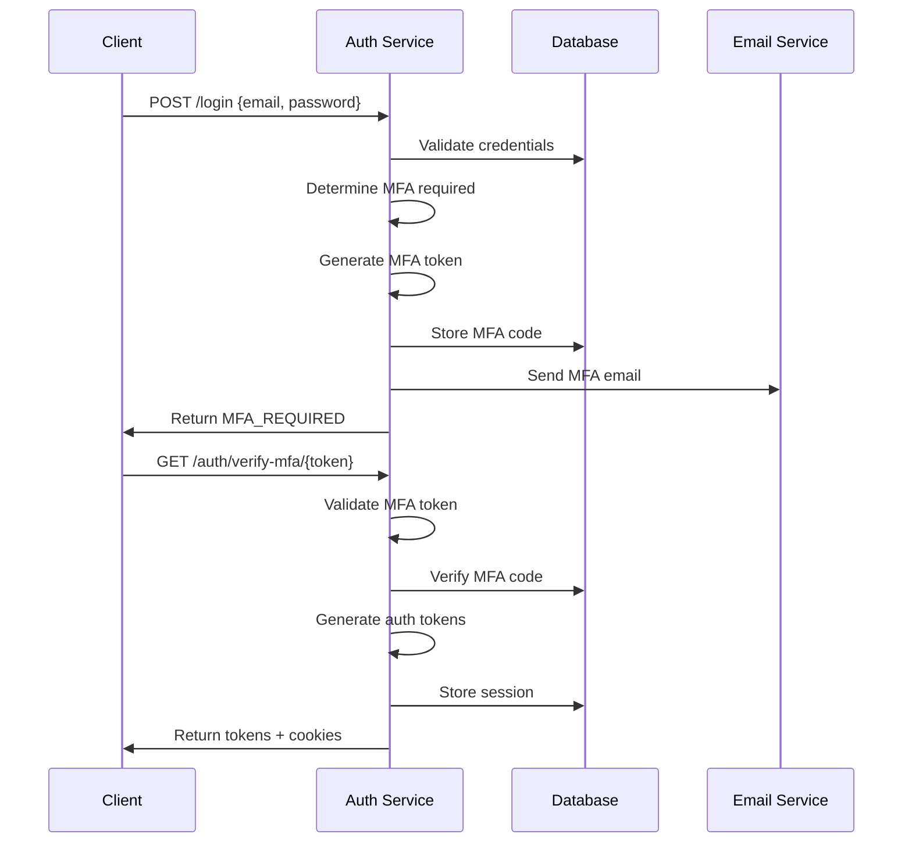
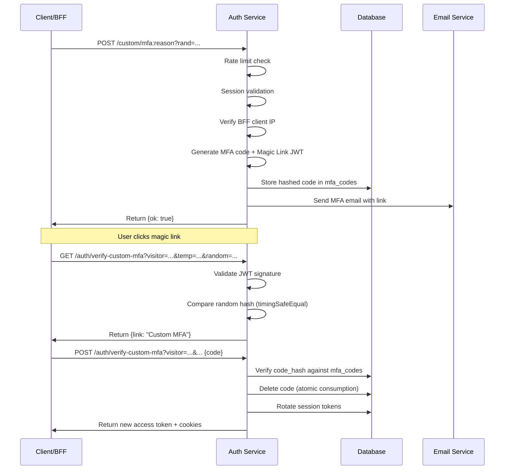

# Architecture Guide

This document outlines the architectural patterns, design decisions, and deployment strategies for the JWT Auth Library.

## Table of Contents

- [System Architecture](#system-architecture)
- [Component Design](#component-design)
- [Security Architecture](#security-architecture)
- [Deployment Patterns](#deployment-patterns)
- [Data Flow](#data-flow)
- [Scalability Considerations](#scalability-considerations)

## System Architecture

### High-Level Overview

The JWT Auth Library follows a **centralized authentication service** architecture where authentication logic is concentrated in a single service that other components rely on.

```
┌─────────────────┐    ┌─────────────────┐    ┌─────────────────┐
│                 │    │                 │    │                 │
│   Web Client    │    │  Mobile App     │    │  Other Services │
│   (Frontend)    │    │   (Native)      │    │   (Microservice)│
└─────────┬───────┘    └─────────┬───────┘    └─────────┬───────┘
          │                      │                      │
          │              ┌───────▼──────┐               │
          │              │              │               │
          └──────────────┤  BFF Server  ├───────────────┘
                         │   (Gateway)  │
                         └───────┬──────┘
                                 │
                         ┌───────▼──────┐
                         │              │
                         │  Auth API    │◄─── Admin Interface
                         │   Service    │
                         │              │
                         └───────┬──────┘
                                 │
                   ┌─────────────▼─────────────┐
                   │                           │
                   │     MySQL Database        │
                   │                           │
                   │ • Users & Sessions        │
                   │ • Rate Limiting Store     │
                   │ • Bot Detection Data      │
                   │ • Visitor Analytics       │
                   └───────────────────────────┘
```

### Key Principles

1. **Single Source of Truth**: All authentication decisions made by one service
2. **Stateless Tokens**: Access tokens are stateless JWTs for horizontal scaling
3. **Stateful Sessions**: Refresh tokens stored in database for security and control
4. **Defense in Depth**: Multiple layers of security (rate limiting, bot detection, etc.)
5. **Observability**: Comprehensive logging and monitoring built-in

## Component Design

### Core Components

#### 1. Authentication Routes (`authenticationRoutes`)
- **Purpose**: Primary user authentication endpoints
- **Responsibilities**:
  - User registration (`/signup`)
  - User login (`/login`) 
  - OAuth integration (`/auth/oauth/:provider`)
- **Dependencies**: Database, rate limiters, bot detection

#### 2. Token Management (`tokenRotationRoutes`)
- **Purpose**: JWT token lifecycle management
- **Responsibilities**:
  - Access token rotation
  - Refresh token management
  - Session termination
- **Security Features**: Token rotation, session limits, anomaly detection

#### 3. Magic Links (`magicLinks`)
- **Purpose**: Passwordless authentication flows
- **Responsibilities**:
  - MFA verification
  - Password reset flows
  - Temporary access tokens
- **Security**: Short-lived tokens, one-time use, email verification

#### 4. Middleware Layer
- **Authentication**: `requireAccessToken`, `requireRefreshToken`, `protectRoute`
- **Security**: Rate limiting, bot detection, input validation
- **Utilities**: Cookie handling, content type validation, XSS protection

### Data Layer

#### Database Schema

```sql
-- Core user authentication
users (id, email, password_hash, visitor_id, ...)
refresh_tokens (id, user_id, token, valid, expires_at, ...)
mfa_codes (id, user_id, token, code_hash, expires_at, ...)

-- Visitor tracking and analytics  
visitors (visitor_id, canary_id, ip_address, user_agent, country, ...)
banned (canary_id, ip_address, reason, score, ...)

-- Bot detection and user agent analysis
user_agent_metadata (http_user_agent, metadata_*, ...)
```

#### Connection Pools

- **Main Pool**: `mysql2/promise` for transactional operations
- **Rate Limiter Pool**: `mysql2` callback API for high-performance rate limiting

## Security Architecture

### Multi-Layer Security Model

```
┌─────────────────────────────────────────────────────────┐
│                    Request Flow                         │
└─────────────────────┬───────────────────────────────────┘
                      │
┌─────────────────────▼───────────────────────────────────┐
│  1. Network Security (Proxy, Rate Limiting)            │
└─────────────────────┬───────────────────────────────────┘
                      │
┌─────────────────────▼───────────────────────────────────┐
│  2. Bot Detection (User Agent, Geo, Behavioral)        │
└─────────────────────┬───────────────────────────────────┘
                      │
┌─────────────────────▼───────────────────────────────────┐
│  3. Input Validation (Schema, Sanitization, XSS)       │
└─────────────────────┬───────────────────────────────────┘
                      │
┌─────────────────────▼───────────────────────────────────┐
│  4. Authentication (JWT, Sessions, MFA)                │
└─────────────────────┬───────────────────────────────────┘
                      │
┌─────────────────────▼───────────────────────────────────┐
│  5. Authorization (Access Control, Resource Protection) │
└─────────────────────────────────────────────────────────┘
```

### Token Security Strategy

#### Access Tokens (Stateless)
- **Type**: JWT with HS256/RS256 signatures
- **Lifetime**: Short (15 minutes default)
- **Storage**: Client-side only
- **Verification**: Cryptographic signature validation
- **Benefits**: Horizontal scaling, no database lookups

#### Refresh Tokens (Stateful)
- **Type**: Random strings with database mapping
- **Lifetime**: Long (7 days default)
- **Storage**: Database (hashed) + secure HTTP-only cookies
- **Verification**: Database lookup and validation
- **Security**: Rotation, revocation, session limits

### Rate Limiting Strategy

#### Multi-Dimensional Limiting
- **IP-based**: Prevent single IP abuse
- **Email-based**: Prevent account-specific attacks  
- **Composite**: Combined IP + email patterns
- **Union Limiters**: Burst + sustained rate limiting

#### Storage Backend
- **MySQL Integration**: Persistent across service restarts
- **Performance**: Optimized for high-throughput scenarios
- **Configuration**: Flexible per-endpoint rate limits

## Deployment Patterns

### 1. Standalone Service

Single dedicated authentication service handling all auth operations.

```
┌─────────────┐    ┌─────────────┐    ┌─────────────┐
│   Client    │───▶│  Auth API   │───▶│  Database   │
│             │    │   Service   │    │             │
└─────────────┘    └─────────────┘    └─────────────┘
```

**Use Cases**:
- Small to medium applications
- Centralized authentication requirements
- Simple deployment and management

### 2. Gateway Pattern

Authentication service behind an API gateway or BFF.

```
┌─────────────┐    ┌─────────────┐    ┌─────────────┐
│   Client    │───▶│   Gateway   │───▶│  Auth API   │
│             │    │     BFF     │    │   Service   │
└─────────────┘    └─────────────┘    └─────────────┘
                           │                   │
                           ▼                   ▼
                   ┌─────────────┐    ┌─────────────┐
                   │  Business   │    │  Database   │
                   │  Services   │    │             │
                   └─────────────┘    └─────────────┘
```

**Use Cases**:
- Microservice architectures
- API composition requirements
- Cross-cutting concerns (CORS, logging, etc.)

### 3. Multi-Instance Deployment

Multiple authentication service instances for high availability.

```
                    ┌─────────────┐
                    │ Load        │
┌─────────────┐────▶│ Balancer    │
│   Client    │     └─────┬───────┘
└─────────────┘           │
                          ├──────┬──────┬──────┐
                          ▼      ▼      ▼      ▼
                    ┌─────────────────────────────┐
                    │   Auth API Instances        │
                    │  ┌───┐  ┌───┐  ┌───┐  ┌───┐ │
                    │  │ 1 │  │ 2 │  │ 3 │  │ N │ │
                    │  └───┘  └───┘  └───┘  └───┘ │
                    └─────────────────────────────┘
                                   │
                                   ▼
                         ┌─────────────┐
                         │  Shared     │
                         │  Database   │
                         └─────────────┘
```

**Benefits**:
- High availability and fault tolerance
- Horizontal scaling capabilities
- Session consistency across instances

## Data Flow

### Authentication Flow



### MFA Flow



### Custom MFA Flow



## Scalability Considerations

### Horizontal Scaling

#### Stateless Design
- Access tokens contain all necessary information
- No server-side session state for token validation
- Database-independent token verification

#### Shared State Management
- Refresh tokens in shared database
- Rate limiting state in MySQL
- Consistent configuration across instances

### Performance Optimizations

#### Caching Strategy
- **Token Verification**: In-memory JWT validation cache
- **Rate Limiting**: LRU cache for frequent IP checks
- **Bot Detection**: Cached user agent patterns
- **Magic Links**: Temporary link cache for MFA

#### Database Optimization
- **Connection Pooling**: Separate pools for different operations
- **Read Replicas**: Read-heavy operations (token validation)
- **Indexing**: Optimized indexes for frequent queries
- **Partitioning**: Time-based partitioning for visitor data

### Monitoring and Observability

#### Metrics
- Authentication success/failure rates
- Token rotation frequency
- Rate limiting effectiveness
- Bot detection accuracy
- Response times and throughput

#### Logging
- Structured logging with request tracing
- Security event logging
- Performance metrics
- Error tracking and alerting

#### Health Checks
- Database connectivity
- External service dependencies
- Memory and CPU utilization
- Token generation performance

## Configuration Management

### Environment-Specific Configuration

#### Development
```json
{
  "logLevel": "debug",
  "jwt": {
    "access_tokens": { "expiresIn": "1h" }
  },
  "rate_limiters": {
    "loginLimiters": { "unionLimiter": { "burstLimiter": { "points": 100 } } }
  }
}
```

#### Production
```json
{
  "logLevel": "warn",
  "jwt": {
    "access_tokens": { "expiresIn": "15m" }
  },
  "rate_limiters": {
    "loginLimiters": { "unionLimiter": { "burstLimiter": { "points": 5 } } }
  }
}
```

### Secret Management

#### Development
- Plain JSON configuration files
- Environment variables for sensitive values

#### Production
- Age encryption for configuration files
- Docker secrets integration
- External secret management systems (HashiCorp Vault, AWS Secrets Manager)

## Best Practices

### Security
1. **Rotate secrets regularly** - JWT secrets, database passwords, API keys
2. **Monitor authentication patterns** - Failed login attempts, unusual locations
3. **Implement proper CORS** - Restrict origins in production
4. **Use HTTPS everywhere** - Never transmit tokens over HTTP
5. **Validate all inputs** - Use Zod schemas for request validation

### Performance
1. **Optimize database queries** - Use proper indexes and query patterns
2. **Implement caching** - Cache frequently accessed data
3. **Monitor resource usage** - CPU, memory, database connections
4. **Load test regularly** - Ensure system handles expected traffic

### Operational
1. **Centralized logging** - Aggregate logs from all instances
2. **Health check endpoints** - Monitor service availability
3. **Graceful degradation** - Handle partial system failures
4. **Backup strategies** - Regular database backups and recovery testing